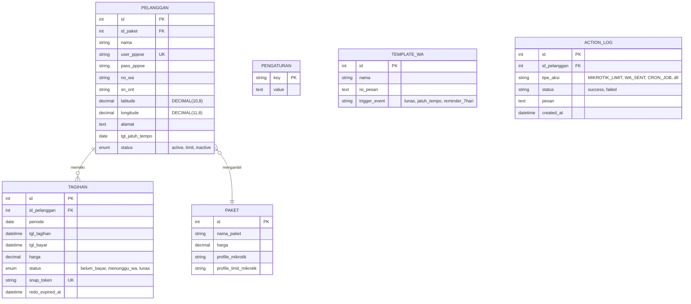
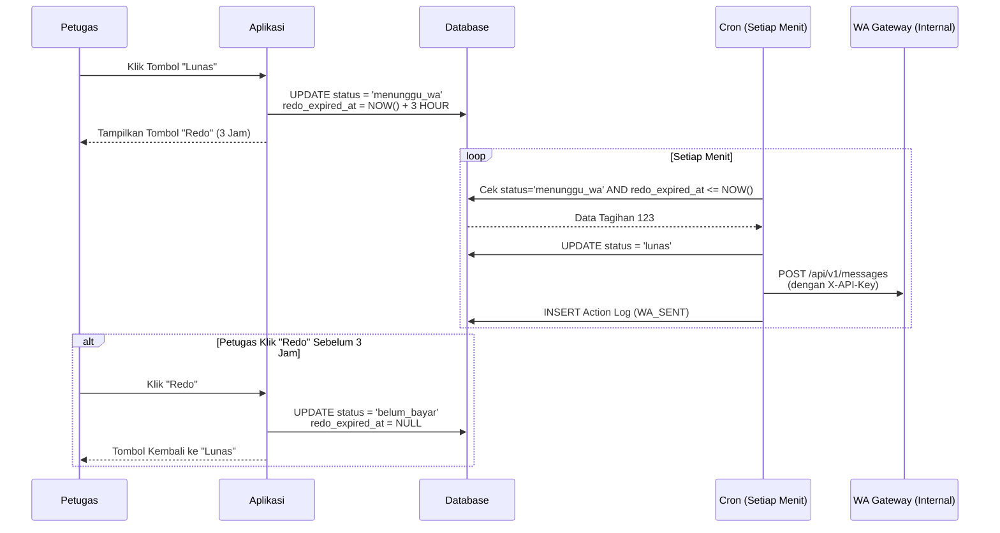

# 📘 Blueprint Aplikasi Dashboard Billing ISP "Menet-Tech"

**Versi:** 2.0.0 Final (Integrated with Internal WA Gateway)  
**Stack:** PHP 8.1+ (Native MVC), MySQL, Bootstrap 5, Chart.js, Leaflet.js, DataTables, MikroTik API, **WhatsApp Gateway Internal**, Discord Webhook.

---

## Daftar Isi
1.  Arsitektur & ERD (Mermaid)
2.  Alur Bisnis Kritis (Mermaid Flowchart)
3.  Struktur Folder & File
4.  Spesifikasi Teknis Halaman & Fitur
5.  **Spesifikasi Integrasi WhatsApp Gateway (Berdasarkan Dokumentasi Internal)**
6.  Spesifikasi Database (Lihat File `database.sql` Terlampir)
7.  Spesifikasi Cron Job (`scheduler.php`)
8.  Spesifikasi Testing & Coverage (PHPUnit)
9.  🚨 Catatan Kritis Implementasi (WAJIB DIBACA)
10. **Instruksi Final untuk AI Agent (Gunakan Langsung)**

---

## 1. Arsitektur & ERD (Entity Relationship Diagram)



---

## 2. Alur Bisnis Kritis (Flowchart Mermaid)

### 2.1. Alur Klik "Lunas" & Mekanisme "Redo 3 Jam"


### 2.2. Alur Auto Limit & Sinkronisasi MikroTik
```mermaid
graph TD
    A[Cron Job Harian 00:01] --> B{Query: Pelanggan Active<br/>tgl_jatuh_tempo < CURDATE()}
    B -->|Tidak Ada| Z[Selesai]
    B -->|Ada| C[Loop Data Pelanggan]
    C --> D[Update DB: status = 'limit']
    D --> E[Panggil API MikroTik]
    E --> F[Update Profile PPPoE ke 'Limit']
    F --> G{Koneksi Aktif?}
    G -->|Ya| H[Kirim Perintah KICK User]
    G -->|Tidak| I[Lanjut]
    H --> I
    I --> J[Insert Action Log]
    J --> K[Kirim WA Jatuh Tempo via Gateway]
    K --> L[Kirim Discord Webhook Alert]
    L --> Z
```

---

## 3. Struktur Folder & File

```
/isp-billing/
├── .env.example
├── composer.json
├── phpunit.xml
├── public/
│   ├── index.php                 # Front Controller
│   ├── assets/                   # css, js, vendor, uploads
│   └── .htaccess                 # Rewrite rule
├── app/
│   ├── Config/
│   │   └── Database.php          # Koneksi PDO
│   ├── Controllers/
│   │   ├── AuthController.php
│   │   ├── DashboardController.php
│   │   ├── PelangganController.php
│   │   ├── TagihanController.php
│   │   ├── MapsController.php
│   │   ├── TemplateController.php
│   │   ├── PaketController.php
│   │   └── PengaturanController.php
│   ├── Models/
│   │   ├── Pelanggan.php
│   │   ├── Tagihan.php
│   │   ├── Paket.php
│   │   ├── TemplateWA.php
│   │   ├── ActionLog.php
│   │   ├── Pengaturan.php
│   │   ├── MikroTikAPI.php       # Wrapper RouterOS
│   │   └── WhatsAppAPI.php       # Client ke WA Gateway Internal
│   ├── Views/
│   │   ├── layouts/
│   │   │   ├── header.php
│   │   │   ├── sidebar.php
│   │   │   └── footer.php
│   │   └── (folder per halaman)
│   ├── Core/
│   │   ├── Router.php
│   │   ├── Controller.php
│   │   └── Session.php
│   └── Helpers/
│       ├── discord.php
│       └── url.php
├── cron/
│   └── scheduler.php             # CLI Script (Lock File Implemented)
├── tests/
│   ├── Unit/                     # PelangganTest, TagihanTest, dll
│   ├── Integration/              # MikroTikAPITest (dengan Mock)
│   └── bootstrap.php
├── database/
│   └── database.sql              # File SQL yang disediakan terpisah
└── README.md
```

---

## 4. Spesifikasi Teknis Halaman & Fitur

| Halaman | Fitur Wajib | Detail Implementasi |
| :--- | :--- | :--- |
| **Dashboard** | Summary Cards, Grafik Pendapatan | Gunakan Chart.js Bar Chart. Widget: Total Pelanggan Aktif, Total Limit, Total Tunggakan. |
| **Pelanggan** | CRUD + Map Picker + Copy SN ONT | Validasi `user_pppoe` unique. Leaflet dengan **Nominatim Geocoder** (tambahkan suffix `, Kota, Indonesia`). Tombol copy SN via `navigator.clipboard`. |
| **Tagihan** | List Filterable + Aksi Lunas/Redo | DataTables Server-Side. Tombol Lunas → AJAX → Ubah status ke `menunggu_wa`. Jika `redo_expired_at` masih valid tampilkan tombol "Redo". Tombol "WA Me" buka new tab `wa.me`. Tombol "WA Gateway" panggil backend (gunakan API internal). |
| **Maps** | Visualisasi Semua Pelanggan | Leaflet dengan marker warna: **Hijau** (active), **Kuning** (jatuh tempo minggu ini), **Merah** (limit), **Abu-abu** (inactive). Popup berisi Nama, Paket, SN ONT + tombol copy. |
| **Template WA** | CRUD Template + Placeholder | Textarea + tombol "Sisipkan Variabel". Simpan dengan `trigger_event`. Parsing saat kirim. |
| **Pengaturan** | Nama ISP, Rekening, **WA Gateway URL & API Key**, Discord URL, MikroTik | Form simpan ke tabel `pengaturan`. Validasi URL Discord & WA. |
| **Master Paket** | CRUD Nama, Harga, Profile MikroTik | Validasi: Jangan hapus jika masih digunakan pelanggan. |

---

## 5. Spesifikasi Integrasi WhatsApp Gateway (Berdasarkan Dokumentasi Internal)

Aplikasi **WAJIB** menggunakan **WhatsApp Gateway Internal** yang sudah disediakan (sesuai dokumentasi `whatsapp-api.md`). Berikut aturan integrasinya:

### 5.1. Konfigurasi di Pengaturan
Tambahkan field berikut di tabel `pengaturan`:
- `wa_gateway_url`: Base URL Gateway (contoh: `http://localhost:3000`)
- `wa_api_key`: API Key untuk header `X-API-Key`
- `wa_account_id`: (Opsional) Default account ID untuk `X-Account-Id` (default: `default`)

### 5.2. Format Nomor Tujuan
Gateway secara otomatis memformat nomor yang dikirim. **Cukup kirim nomor dalam format `6281234567890`** (tanpa `@c.us`). Backend akan mengirim string tersebut apa adanya ke field `to`.

### 5.3. Implementasi Class `WhatsAppAPI`
Buat class `app/Models/WhatsAppAPI.php` dengan method utama:

```php
class WhatsAppAPI {
    private $baseUrl;
    private $apiKey;
    private $accountId;

    public function __construct() {
        $this->baseUrl = Pengaturan::get('wa_gateway_url');
        $this->apiKey = Pengaturan::get('wa_api_key');
        $this->accountId = Pengaturan::get('wa_account_id', 'default');
    }

    /**
     * Kirim pesan teks via Gateway Internal
     * @param string $to Nomor tujuan (format 628xxx)
     * @param string $message Isi pesan
     * @return array ['success' => bool, 'message_id' => string, 'error' => string]
     */
    public function sendText($to, $message) {
        $url = rtrim($this->baseUrl, '/') . '/api/v1/messages';
        
        $payload = [
            'to' => $to,
            'text' => $message
        ];
        
        $ch = curl_init($url);
        curl_setopt($ch, CURLOPT_POST, true);
        curl_setopt($ch, CURLOPT_POSTFIELDS, json_encode($payload));
        curl_setopt($ch, CURLOPT_HTTPHEADER, [
            'Content-Type: application/json',
            'X-API-Key: ' . $this->apiKey,
            'X-Account-Id: ' . $this->accountId
        ]);
        curl_setopt($ch, CURLOPT_RETURNTRANSFER, true);
        curl_setopt($ch, CURLOPT_TIMEOUT, 10);
        
        $response = curl_exec($ch);
        $httpCode = curl_getinfo($ch, CURLINFO_HTTP_CODE);
        $error = curl_error($ch);
        curl_close($ch);
        
        if ($error) {
            return ['success' => false, 'error' => "cURL Error: $error"];
        }
        
        $data = json_decode($response, true);
        
        if ($httpCode === 200 && isset($data['status']) && $data['status'] === 'success') {
            return [
                'success' => true,
                'message_id' => $data['id'] ?? null
            ];
        }
        
        // Fallback: Jika gateway gagal, buka wa.me (opsional, bisa diatur via flag)
        if (Pengaturan::get('wa_fallback_wa_me', 'true') === 'true') {
            // Tidak mengembalikan error, tapi mengembalikan URL untuk dibuka manual
            $waMeUrl = 'https://wa.me/' . $to . '?text=' . urlencode($message);
            return ['success' => false, 'fallback_url' => $waMeUrl];
        }
        
        return [
            'success' => false,
            'error' => $data['message'] ?? 'Unknown error'
        ];
    }
}
```

### 5.4. Tombol "WA Me" (Fallback Manual)
Di halaman Tagihan, tombol **"WA Me"** akan selalu membuka tab baru dengan URL:
```
https://wa.me/{no_wa}?text={encoded_message}
```
Ini berguna jika Gateway sedang offline atau API Key belum diatur.

### 5.5. Parsing Template WA
Sebelum dikirim, template dari database diparsing dengan `str_replace`:

```php
$placeholders = [
    '{nama}', '{no_wa}', '{paket}', '{harga}', '{bulan}', 
    '{jatuh_tempo}', '{tanggal_bayar}', '{nama_isp}', '{no_rekening}'
];
$values = [
    $pelanggan['nama'],
    $pelanggan['no_wa'],
    $pelanggan['nama_paket'],
    number_format($tagihan['harga'], 0, ',', '.'),
    $bulan, // Format: "April 2026"
    date('d/m/Y', strtotime($pelanggan['tgl_jatuh_tempo'])),
    date('d/m/Y H:i', strtotime($tagihan['tgl_bayar'])),
    Pengaturan::get('nama_isp'),
    Pengaturan::get('no_rekening')
];
$pesan = str_replace($placeholders, $values, $template['isi_pesan']);
```

### 5.6. Penanganan Error & Logging
Setiap percobaan pengiriman WA (baik sukses maupun gagal) **harus** dicatat ke tabel `action_log` dengan:
- `tipe_aksi`: `WA_SENT`
- `status`: `success` / `failed`
- `pesan`: Berisi response dari Gateway atau pesan error

---

## 6. Spesifikasi Database

> **File SQL Lengkap Tersedia Terpisah:**  
> Seluruh struktur database, termasuk tabel `users`, `pengaturan`, `paket`, `pelanggan`, `template_wa`, `tagihan`, `action_log`, `user_sessions`, VIEWS, TRIGGER, dan STORED PROCEDURE sudah disediakan dalam file **`database.sql`** (Versi 1.0.2 Final).  
> **Instruksi:** Gunakan file tersebut **APA ADANYA** untuk membuat database. Jangan membuat ulang skema manual.

Tambahan kolom yang diperlukan di tabel `pengaturan` untuk mendukung WA Gateway:

```sql
INSERT INTO `pengaturan` (`key`, `value`, `description`) VALUES
('wa_gateway_url', 'http://localhost:3000', 'Base URL WhatsApp Gateway Internal'),
('wa_api_key', '', 'API Key untuk akses WA Gateway (X-API-Key)'),
('wa_account_id', 'default', 'Default Account ID untuk WA Gateway (X-Account-Id)'),
('wa_fallback_wa_me', 'true', 'Fallback ke wa.me jika gateway gagal (true/false)');
```

---

## 7. Spesifikasi Cron Job (`cron/scheduler.php`)

**Frekuensi:** Setiap menit via `crontab -e`  
**Perintah:** `* * * * * php /path/to/isp-billing/cron/scheduler.php >> /path/to/logs/cron.log 2>&1`

**Kode Wajib (dengan Lock File dan Integrasi WA Gateway):**
```php
#!/usr/bin/env php
<?php
require_once __DIR__ . '/../vendor/autoload.php';
require_once __DIR__ . '/../app/Config/Database.php';

$lockFile = __DIR__ . '/cron.lock';
if (file_exists($lockFile) && filemtime($lockFile) > time() - 120) {
    die("[" . date('Y-m-d H:i:s') . "] Another cron instance is running.\n");
}
file_put_contents($lockFile, getmypid());

// 1. Proses tagihan 'menunggu_wa' yang expired
$tagihan = new Tagihan();
$menunggu = $tagihan->getMenungguExpired();
foreach ($menunggu as $t) {
    $tagihan->updateStatus($t['id'], 'lunas');
    
    $wa = new WhatsAppAPI();
    $template = TemplateWA::getByTrigger('lunas');
    $pesan = TemplateWA::parse($template['isi_pesan'], $t);
    $result = $wa->sendText($t['no_wa'], $pesan);
    
    $logStatus = $result['success'] ? 'success' : 'failed';
    $logPesan = $result['success'] ? $result['message_id'] : ($result['error'] ?? 'Unknown error');
    ActionLog::create($t['id_pelanggan'], 'WA_SENT', $logStatus, $logPesan);
    
    sendDiscord(getSetting('discord_billing_url'), "Pembayaran lunas: {$t['nama']}");
}

// 2. Proses pelanggan jatuh tempo -> limit + kick MikroTik
$pelanggan = new Pelanggan();
$jatuhTempo = $pelanggan->getJatuhTempo();
foreach ($jatuhTempo as $p) {
    $pelanggan->updateStatus($p['id'], 'limit');
    $mt = new MikroTikAPI();
    $result = $mt->limitUser($p['user_pppoe'], $p['profile_limit_mikrotik']);
    ActionLog::create($p['id'], 'MIKROTIK_LIMIT', $result ? 'success' : 'failed', 'Auto limit jatuh tempo');
    
    if ($result) {
        $wa = new WhatsAppAPI();
        $template = TemplateWA::getByTrigger('jatuh_tempo');
        $pesan = TemplateWA::parse($template['isi_pesan'], $p);
        $wa->sendText($p['no_wa'], $pesan);
        sendDiscord(getSetting('discord_alert_url'), "User {$p['nama']} dilimit otomatis.");
    }
}

// 3. Reminder 7 hari sebelum jatuh tempo
$reminder = $pelanggan->getReminder7Hari();
foreach ($reminder as $p) {
    $wa = new WhatsAppAPI();
    $template = TemplateWA::getByTrigger('reminder_7hari');
    $pesan = TemplateWA::parse($template['isi_pesan'], $p);
    $result = $wa->sendText($p['no_wa'], $pesan);
    ActionLog::create($p['id'], 'WA_SENT', $result['success'] ? 'success' : 'failed', 'Reminder 7 hari');
}

unlink($lockFile);
echo "[" . date('Y-m-d H:i:s') . "] Cron finished.\n";
```

---

## 8. Spesifikasi Testing & Coverage (PHPUnit)

**Target Coverage:** Minimal 75% (Baris Kode).

**File Konfigurasi `phpunit.xml`:**
```xml
<?xml version="1.0" encoding="UTF-8"?>
<phpunit bootstrap="tests/bootstrap.php" colors="true">
    <testsuites>
        <testsuite name="Unit">
            <directory>tests/Unit</directory>
        </testsuite>
        <testsuite name="Integration">
            <directory>tests/Integration</directory>
        </testsuite>
    </testsuites>
    <coverage processUncoveredFiles="true">
        <include>
            <directory suffix=".php">app</directory>
        </include>
        <report>
            <html outputDirectory="tests/_reports/coverage"/>
            <text outputFile="php://stdout" showOnlySummary="true"/>
        </report>
    </coverage>
</phpunit>
```

**Contoh Unit Test dengan Mocking WhatsAppAPI:**
```php
public function testSendReminderUsesWhatsAppGateway() {
    $mockWA = $this->createMock(WhatsAppAPI::class);
    $mockWA->method('sendText')->willReturn(['success' => true, 'message_id' => 'WA123']);
    
    $cron = new Scheduler($mockWA);
    $result = $cron->sendReminder($pelanggan);
    
    $this->assertTrue($result);
    $this->assertDatabaseHas('action_log', ['tipe_aksi' => 'WA_SENT', 'status' => 'success']);
}
```

---

## 9. 🚨 Catatan Kritis Implementasi (WAJIB DITERAPKAN)

### 9.1. MikroTik: Wajib Kick User Setelah Limit
*(Sama seperti sebelumnya)*
```php
public function limitUser($username, $newProfile = 'default-limit') {
    $this->connect();
    $this->client->write('/ppp/secret/set', ['numbers' => $username, 'profile' => $newProfile]);
    $this->client->write('/ppp/active/print', ['.proplist' => '.id', '?name' => $username]);
    $response = $this->client->read(false);
    $active = $this->client->parseResponse($response);
    if (!empty($active)) {
        $this->client->write('/ppp/active/remove', ['.id' => $active[0]['.id']]);
    }
    $this->disconnect();
    return true;
}
```

### 9.2. Cron Job: Lock File Anti Double-Sending
*(Sudah termasuk di Bab 7)*

### 9.3. Geocoding Leaflet: Tambahkan Suffix Lokasi
```javascript
const query = `${alamat}, ${kota}, Indonesia`;
fetch(`https://nominatim.openstreetmap.org/search?format=json&q=${encodeURIComponent(query)}`);
```

### 9.4. Unit Testing: Mock Semua API Eksternal
**Wajib** mock `WhatsAppAPI`, `MikroTikAPI`, dan `Discord Webhook`. Jangan pernah memanggil API sungguhan dalam test.

### 9.5. WA Gateway: Fallback `wa.me`
Di class `WhatsAppAPI`, jika konfigurasi `wa_fallback_wa_me = true` dan pengiriman via gateway gagal, kembalikan URL `wa.me` agar frontend bisa membuka tab baru. Ini memastikan komunikasi tetap bisa dilakukan meski gateway bermasalah.

---

## 10. Instruksi Final untuk AI Agent (Gunakan Langsung)

> **Prompt Lengkap untuk AI Coder:**
> 
> "Implementasikan aplikasi Billing ISP **'Menet-Tech'** berdasarkan blueprint terlampir. Gunakan spesifikasi berikut:
> 
> **Backend:**
> - PHP 8.1+ dengan pola MVC sederhana tanpa framework besar.
> - Database MySQL/MariaDB menggunakan file **`database.sql`** yang sudah disediakan (jangan buat ulang skema).
> - Gunakan PDO dengan prepared statements.
> - Implementasikan Router sederhana.
> - Sediakan file `.env.example` dengan semua variabel lingkungan.
> 
> **Frontend:**
> - Bootstrap 5, Chart.js, DataTables (server-side), Leaflet.js.
> - SweetAlert2 untuk konfirmasi.
> 
> **Integrasi WA Gateway (Sesuai Dokumentasi `whatsapp-api.md`):**
> - Buat class `WhatsAppAPI` yang mengirim POST ke `{base_url}/api/v1/messages`.
> - Header: `X-API-Key`, `X-Account-Id`.
> - Body: `{ "to": "628xxx", "text": "pesan" }`.
> - Implementasikan fallback ke `wa.me` jika gagal dan `wa_fallback_wa_me = true`.
> - Semua pengiriman WA dicatat di `action_log`.
> 
> **Fitur Wajib:**
> 1. Autentikasi (login/logout) dengan `users`.
> 2. CRUD Pelanggan, Paket, Template WA, Pengaturan.
> 3. Halaman Tagihan dengan filter, Lunas, Redo (3 jam), WA Me, dan WA Gateway.
> 4. Halaman Maps dengan marker berwarna.
> 5. Dashboard dengan ringkasan dan grafik.
> 
> **MikroTik:**
> - Library `evilfreelancer/routeros-api-php`.
> - Method `limitUser()` wajib mengubah profile dan **KICK** koneksi aktif.
> 
> **Cron Job:**
> - `cron/scheduler.php` dengan lock file.
> - Proses: (1) Tagihan `menunggu_wa` expired → lunas + WA, (2) Pelanggan jatuh tempo → limit + MikroTik + WA, (3) Reminder 7 hari.
> 
> **Testing:**
> - PHPUnit dengan coverage ≥75%.
> - Mock `WhatsAppAPI`, `MikroTikAPI`, dan Discord.
> 
> **File yang Harus Dihasilkan:**
> - Seluruh struktur folder aplikasi.
> - `composer.json`, `phpunit.xml`, `.env.example`.
> - **Gunakan file `database.sql` yang sudah ada untuk migrasi.** "